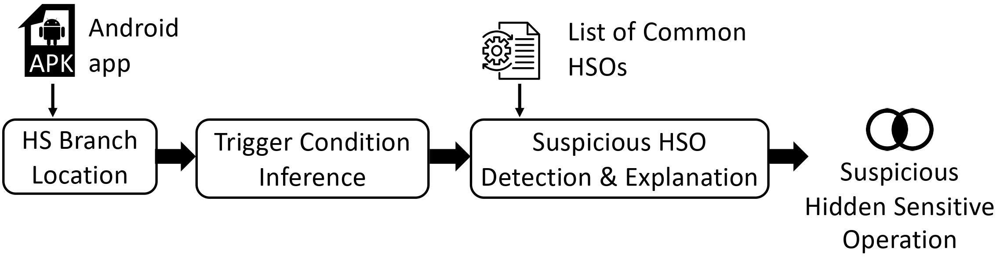

Hidden Sensitive Operation

## HiSenDroid

[Abstract] Security of Android devices is now paramount, given their wide adoption among consumers.
As researchers develop tools for statically or dynamically detecting suspicious apps, malware writers regularly update their attack mechanisms to hide malicious behavior implementation.
This poses two problems to current research techniques: static analysis approaches, given their over-approximations, can report an overwhelming number of false alarms, while dynamic approaches will miss those behaviors that are hidden through evasion techniques.
We propose in this work a static approach specifically targeted at highlighting hidden sensitive operations, mainly sensitive data flows. The prototype version of HiSenDroid has been evaluated on a large-scale dataset of thousands of malware and goodware samples on which it successfully revealed anti-analysis code snippets aiming at evading detection by dynamic analysis. We further experimentally show that, with FlowDroid, some of the hidden sensitive behaviors would eventually lead to private data leaks.
Those leaks would have been hard to spot either manually among the large number of false positives reported by the state of the art static analyzers, or by dynamic tools. Overall, by putting the light on hidden sensitive operations, HiSenDroid helps security analysts in validating potential sensitive data operations, which would be previously unnoticed.

#### Our paper has been accepted at TOSEM 2022!

## Approach

This figure illustrates the working process of HiSenDroid. It achieves the aforementioned goal through three main modules, namely: (1) Hidden Sensitive Branch Location; (2) Trigger Condition Inference; (3) Suspicious HSO Detection and Explanation.

Please refer to our paper for much detail.

## Setup
The following is required to set up HSO:
 MAC system

##### Step 1: Load dependencies to your local repository
* git clone git@github.com:SMAT-Lab/HiSenDroid.git
* cd hisendroid
* ./res/loadDependencies.sh

##### Step 2: build package：
mvn clean install

##### Step 3: example of running HSO(3 parameters):
* Main Method: edu.anonymous.Main
* Parameters are needed here: [your_apk_path.apk],[path of android.jar],[path of psCout.txt]
* example:
/yourpath/a0b2075ec2ace0b12489668d08d85c3a.apk
/yourpath/android-platforms/android-17/android.jar
/yourpath/HSO/res/psCout.txt

